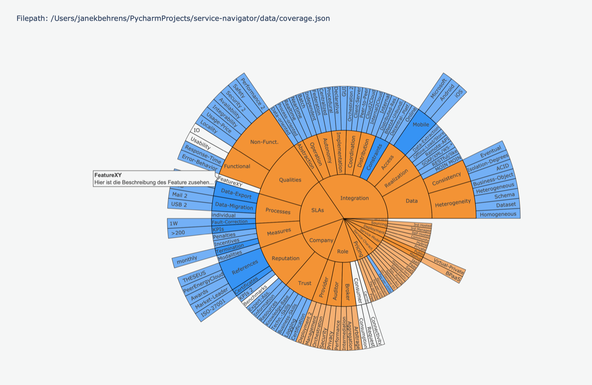
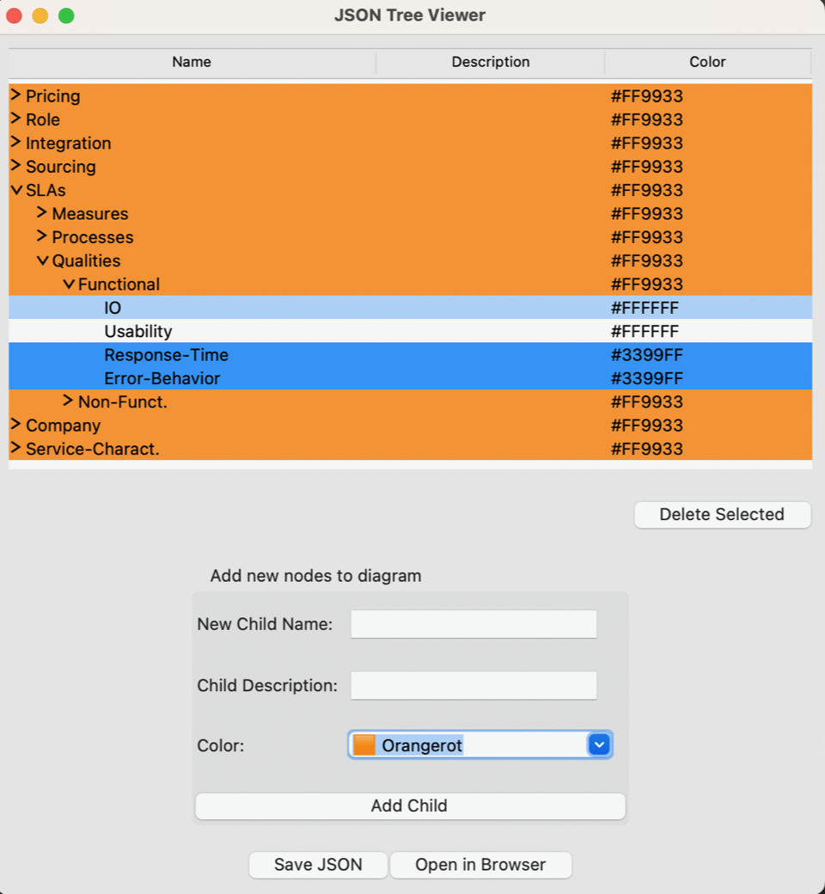

# edam-mq-navigator

This tool is used to generate a sunburst plot that is able to show a Message-Queuing diagram. 
You can see the result on the following image.

This is the JSON Tree Viewer, the UI is based on tkinter. 
The purpose of this tool is to enable everyone to add or modify data in the sunburst plot.

